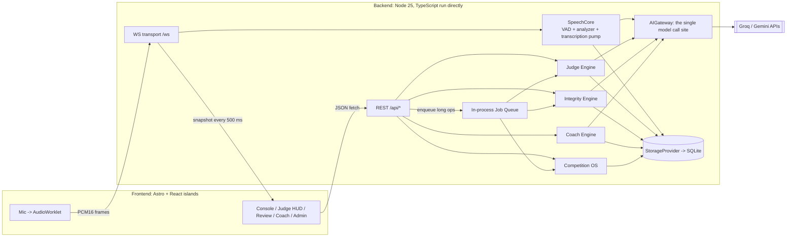
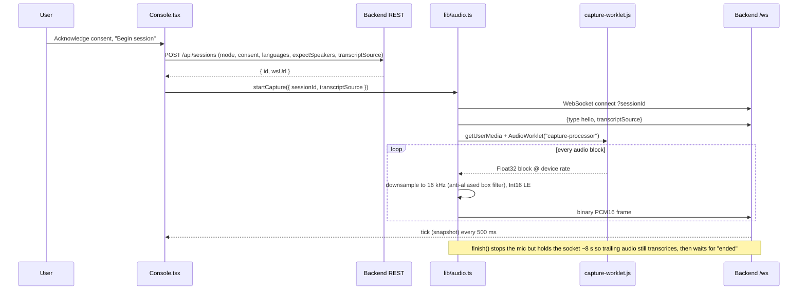
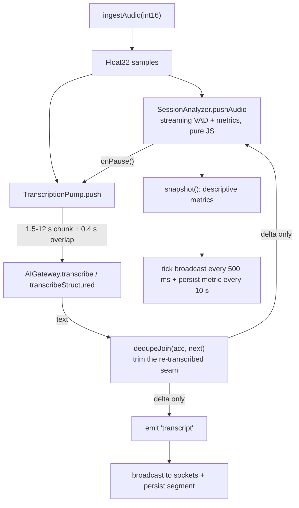
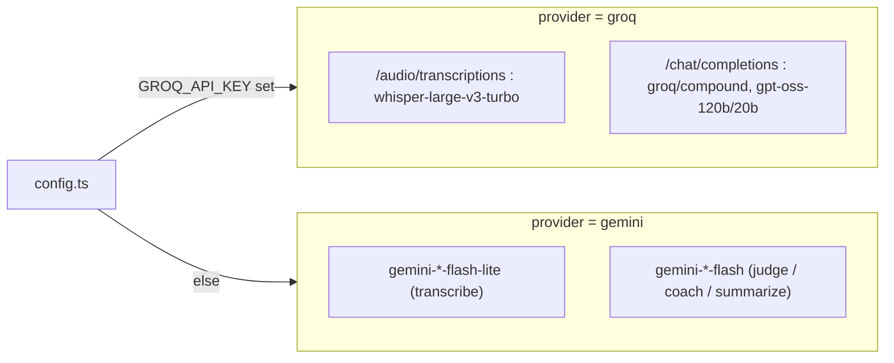
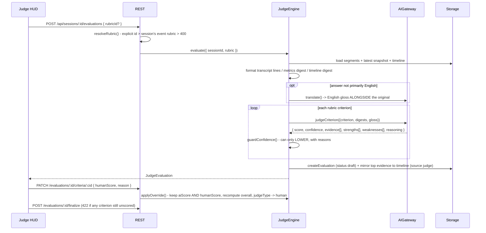
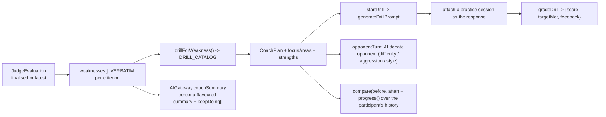
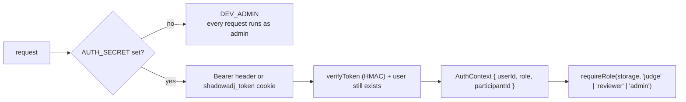

<!--
This file is a slide deck in Markdown. Every `---` on its own line starts a new
slide. HTML comments like this one are Marp speaker notes.

Render it with any of:
  Marp        ->  npx @marp-team/marp-cli PRESENTATION.md -o ShadowADJ.pptx
  Marp        ->  npx @marp-team/marp-cli PRESENTATION.md -o ShadowADJ.pdf
  VS Code     ->  "Marp for VS Code" extension, then Export
  reveal.js   ->  pandoc -t revealjs -s PRESENTATION.md -o ShadowADJ.html
It also reads fine as a plain document on GitHub.
-->

# ShadowADJ

### Real-Time AI Assistance Monitoring for Competitive Debate

**Consent-first speech console · Rubric-driven AI judging · Multi-signal integrity review · Adaptive coaching · Competition operations**

`v0.2` · TypeScript monorepo · Node 25 backend · Astro + React frontend

<!--
One-line pitch: ShadowADJ listens to live speech, shows *descriptive* metrics
(pace, pauses, fillers, vocabulary diversity, answer latency), and layers on
optional AI judging, integrity review and coaching - with a human always in the
final decision seat. It is a mirror, not a verdict machine.
-->

---

## The problem

- A debate adjudicator is already **flowing arguments, tracking rebuttals, comparing clashes, assessing delivery, and preparing an oral adjudication**.
- They cannot also act as a real-time "AI-use investigator".
- Honest competitors who prepared for months can lose a round, a ranking, or a qualification to an **undisclosed AI advantage** the judge never had bandwidth to notice.

### The response

A quiet background system that surfaces **timestamped evidence markers** — never a verdict — so the human can focus on the debate and still make an informed integrity call.

<!--
Framing matters: the product is evidence-for-a-human, not automated accusation.
Everything downstream (risk levels, confidence guards, human-review gates) exists
to protect that framing.
-->

---

## Design principles (enforced in code, not just copy)

| Principle | Where it lives |
| --- | --- |
| **Consent-first** — a session cannot start until both parties acknowledge in the UI | `domain/entities.ts` `createSession` -> 403 on missing consent |
| **Descriptive, not evaluative** — the live snapshot never contains a "verdict" or "authorship" field | `speech-core` + snapshot tests |
| **No lonely signal** — no single integrity signal can reach HIGH risk on its own | `integrity/signals.ts` `SINGLE_CONTRIBUTION_CAP = 35` |
| **AI proposes, human disposes** — every judge criterion is overridable; both scores are kept | `judge-engine/index.ts` `applyOverride` |
| **Confidence can only go down** — a deterministic guard caps the model's self-reported confidence | `judge-engine/confidence.ts` `guardConfidence` |
| **Performance != integrity** — a judge evaluation carries no integrity signal, ever | separate engines, asserted in tests |

<!--
These are the constraints reviewers and organisers care about. Each is a real
code path with a test, not a marketing sentence.
-->

---

## System at a glance



<!--
Key idea: `index.ts` is a *thin* transport. It does REST routing and WS framing
and nothing else. Speech lives in speech-core, model calls in the gateway,
durability in storage, session lifecycle in SessionManager, domain logic in the
four engines.
-->

---

## Tech stack — backend

| Area | Choice | Notes |
| --- | --- | --- |
| Language / runtime | **TypeScript on Node 25**, run **directly** (`node src/index.ts`) | `--watch` for dev, no build step; `allowJs` picks up the two pure-JS analyzer files |
| HTTP | **Express 4** | `cors`, `express.json({ limit: '256kb' })`, one central error handler mapping `HttpError` / `ValidationError` to a status |
| Realtime | **`ws`** `WebSocketServer` on `path: '/ws'` | shares the same `http.Server` as Express |
| Storage | **`node:sqlite`** (`DatabaseSync`) | built-in, no native module to compile, single file, `schema.sql` + idempotent `migrate()` |
| AI SDK | **`@google/generative-ai`** for Gemini; raw **`fetch`** for Groq's OpenAI-compatible endpoints | selected by `AI_PROVIDER` / which key is set |
| Auth | **`node:crypto`** scrypt hashes + HMAC-signed tokens | no dependency; `AUTH_SECRET` toggles enforcement |
| Config | **`dotenv`** | `.env` at repo root, per-engine model-routing overrides |
| Tests | **`node:test`** | 151 cases; `tsc --noEmit` for types |

<!--
Deliberately dependency-light. The only heavyweight dep is the Gemini SDK, and
even that is optional - Groq goes through plain fetch.
-->

---

## Tech stack — frontend

| Area | Choice | Notes |
| --- | --- | --- |
| Framework | **Astro 4**, `output: "static"` | 8 pre-rendered pages: `/`, `/about`, `/console`, `/judge`, `/review`, `/coach`, `/admin`, `/history` |
| Interactivity | **React 18 islands** via `client:only="react"` | each page mounts one root component (`Console`, `JudgeView`, ...) |
| State | **Zustand** | one store (`lib/store.ts`) for the live console: `status`, `sessionId`, `snapshot`, `energy`, `transcriptLive`, `notices` |
| Styling | **Tailwind 3** via `@astrojs/tailwind` | glassmorphic dark theme; `mint` / `cyan` / `amber` / `rose` accent tokens |
| 3D | **Three.js** | `Sphere` (reactive audio orb) and `ConsentVisualizer3D` |
| Audio capture | **Web Audio `AudioWorklet`** (`public/capture-worklet.js`) + `AnalyserNode` | 16 kHz PCM16 out over the socket |
| Fallback STT | **Web Speech API** (`webkitSpeechRecognition`, Chrome) | wrapped in `lib/speech.ts`, auto-restart on `onend` |
| API clients | hand-written `fetch` wrappers | `lib/api.ts`, `judgeApi.ts`, `reviewApi.ts`, `coachApi.ts`, `adminApi.ts` |

<!--
No SPA router, no data-fetching library. Each Astro page is its own entry point;
query params (?session=..., ?evaluation=...) carry cross-page context.
-->

---

## Monorepo layout

```text
ShadowAdj/                 npm workspaces: backend + frontend
├─ backend/src/
│  ├─ index.ts             thin REST + WS transport
│  ├─ config.ts            env -> typed config, provider + model routing
│  ├─ session.ts           SessionManager: runtime sessions <-> storage
│  ├─ shared/protocol.ts   typed WebSocket message contract + validator
│  ├─ speech-core/         audio ingest -> streaming VAD -> analyzer; transcription pump
│  ├─ ai/                  AIGateway (single call site) + prompt builders + JSON validators
│  ├─ judge-engine/        rubric -> per-criterion score + evidence + confidence guard
│  ├─ integrity/           source match, cross-participant, style, session hashing, signal aggregation
│  ├─ coach/               judge weaknesses (verbatim) -> drills + AI opponent + progress
│  ├─ competition/         consensus, tie-break, leaderboard, analytics, replay bundle
│  ├─ storage/             StorageProvider interface + SqliteStorage
│  ├─ domain/              Event / Round / Participant / Session / Rubric entities + validators
│  ├─ auth/                scrypt hash, HMAC tokens, RBAC middleware
│  └─ jobs/                in-process FIFO job queue
└─ frontend/src/
   ├─ pages/*.astro        one island mount per page
   ├─ components/*.tsx     Console, JudgeView, ReviewView, CoachView, AdminView, ...
   └─ lib/                 store, api clients, audio, speech, formatting, history
```

---

## The realtime "conversation": WebSocket contract

`ws://<host>/ws?sessionId=<id>` — validated on connect; unknown session closes with code `4004`.

### Client -> Server

| Frame | Payload | Meaning |
| --- | --- | --- |
| **binary** | raw little-endian **PCM16 mono @ 16 kHz** | live mic audio (handled outside the JSON union) |
| `hello` | `{ transcriptSource: 'server' \| 'browser' }` | choose transcription mode for this socket |
| `transcript` | `{ text, isFinal }` | browser-STT result fed back to the analyzer |
| `question` | `{ label }` | mark "a question was asked" -> starts an answer-latency clock |
| `end` | — | finalise the session |

### Server -> Client

`ready` · `config` · **`tick`** (snapshot + energy + `transcribing` + timer, **every 500 ms**) · `transcript` (`{text, isFinal, source}`) · `timeline` · `notice` · `transcription-fallback` · `ended` (`{export}`) · `error`

<!--
shared/protocol.ts is the source of truth for both ends. parseClientMessage
JSON-parses, type-checks, sanitises (e.g. clamps a `question` label to 80 chars)
and returns null for anything unrecognised - the handler simply ignores null.
Wire shapes are frozen from v0 so no client migration was ever needed.
-->

---

## Data flow 1 — browser audio capture



<!--
getUserMedia is requested with echoCancellation + noiseSuppression +
autoGainControl + mono. An AnalyserNode (fftSize 1024) is tapped off the same
source for the local 3D orb / meter without round-tripping the server.
-->

---

## Data flow 2 — SpeechCore on the server



- **`snapshot()`** fields: `elapsedMs`, `transcript{text,wordCount,source}`, `pace{wpm,descriptor,ready}`, `pauses{count,meanMs,longestMs}`, `fillers{hard/softPerMin, examples, ready}`, `vocabulary{variety(MATTR), longWordRate, meanUnitLength}`, `delivery{talkRatio, speakingSecondsTotal}`, `answerLatency`, `timeline[]`.
- Noisy metrics are **gated by a `ready` flag** until there is enough evidence.

<!--
The analyzer + metrics files are the only JavaScript left in the backend: pure,
fully unit-tested, no upside to a risky hand-migration. allowJs compiles them.
-->

---

## Data flow 3 — the transcription pump in detail

- Buffers incoming PCM16. Sends a chunk when **>= 1.5 s** is buffered (streaming), forces a send on a **VAD pause >= 0.5 s**, caps a chunk at **12 s**, and carries a **0.4 s overlap** into the next chunk.
- Each chunk is wrapped to a **WAV** blob in-memory and sent to the gateway:
  - English-only -> `ai.transcribe(chunk)`
  - Multilingual / diarized -> `ai.transcribeStructured(chunk, { languages, expectSpeakers })` -> utterances `{text, lang, speaker}`
- **`dedupeJoin(acc, next)`** removes the re-transcribed overlap: it aligns up to 12 trailing words of `acc` against the leading words of `next`, tolerating 1 near-miss via prefix / Levenshtein-<=1, and appends only what is genuinely new. Only that **delta** is emitted and persisted.
- **3 consecutive failures => `stop()` + `onFallback`** -> SpeechCore flips to `browser` transcription, emits a `transcription-fallback` notice, and the client's Web Speech API takes over.

<!--
This is why live transcription feels continuous rather than stuttering, and why
a flaky model key degrades to browser STT instead of a dead transcript.
-->

---

## The AIGateway — one call site, many guarantees

> "The one place a model is called." Every engine goes through it; nothing calls Groq/Gemini directly.

Each method:

1. **Builds a compact prompt from structured state** — metric digests, timeline digests, transcript lines with `mm:ss` stamps — *not* raw transcript spam.
2. **Walks a model fallback list** — on `404` / `503` it tries the next model in `config.ai.models.<op>`; any other error propagates.
3. **For JSON methods:** `extractJson` -> `validate()` -> on failure **retry once with a repair hint** -> else return a **typed fallback**. It **never throws into the request path**.
4. **Caches** stable results by SHA-256 of `(op + parts)`.
5. **Logs** `{ op, model, ms, ok, inputTokens, outputTokens, estCostUsd }` — surfaced at `GET /api/ai/cost`.

Methods: `transcribe`, `transcribeStructured`, `translate`, `generateCoach`, `judgeCriterion`, `coachSummary`, `generateDrillPrompt`, `opponentTurn`, `gradeDrill`.

<!--
`_call` is a test seam: pass a fake (model, parts) => {text} and the whole
gateway runs deterministically with no network. That is how 151 tests exercise
AI-dependent paths.
-->

---

## Provider routing



- `serverTranscription = (TRANSCRIPTION=auto) && ai.enabled` — otherwise the browser does STT.
- **Whisper hallucination filter:** a bare `"thank you"`, `"thanks for watching"`, `"please subscribe"`, `"you"`, `"bye"` from an empty chunk is dropped, not transcribed.
- **Multilingual** kicks in automatically when the session/event lists a non-English language, `expectSpeakers > 1`, or `MULTILINGUAL=always`.
- Per-engine overrides: `GROQ_JUDGE_MODEL` / `GEMINI_SIMILARITY_MODEL` / `..._SUMMARIZE_MODEL`, etc.

---

## REST API surface (grouped)

| Group | Representative endpoints |
| --- | --- |
| **Health / ops** | `GET /api/health`, `POST /api/seed`, `GET /api/ai/cost` |
| **Auth** | `POST /api/auth/register` · `login` · `logout`, `GET /api/auth/me` · `users` |
| **Domain** | `POST/GET /api/events`, `.../rounds`, `.../participants`, `PUT /api/events/:id/rubric` |
| **Rubrics** | `GET /api/rubrics`, `GET /api/rubrics/presets`, `POST /api/rubrics` |
| **Sessions** | `POST /api/sessions`, `POST /api/sessions/simulate`, `GET .../export` · `audit` · `timeline` · `language` · `speakers` · `transcript`, `POST .../end` |
| **Judging (Phase 2)** | `POST/GET /api/sessions/:id/evaluations`, `PATCH /api/evaluations/:id/criteria/:cid`, `POST .../finalize` · `reopen` |
| **Integrity (Phase 3-4)** | `POST/GET /api/sessions/:id/integrity`, `GET /api/integrity-cases/:id` (+ `graph`, `participant-view`), `POST .../review` · `appeal` · `respond` |
| **Coaching (Phase 6)** | `POST /api/sessions/:id/coach/plan`, `POST /api/coach-plans/:id/drills`, `POST /api/drills/:id/grade` · `opponent`, `POST /api/coach/compare`, `GET /api/participants/:id/progress` |
| **Competition OS (Phase 7)** | `GET /api/sessions/:id/consensus`, `POST /api/events/:id/tiebreak`, `GET /api/events/:id/leaderboard?view=admin` · `analytics` · `audit`, `GET /api/sessions/:id/replay` |
| **Jobs** | `POST /api/jobs`, `GET /api/jobs` · `jobs/stats` · `jobs/:id` |

<!--
wrap() adapts sync/async handlers to Express and funnels every throw to the one
error middleware. requireRole(storage, 'judge') etc. gate the privileged routes
when auth is enabled.
-->

---

## Sequence — a full live session, end to end

```mermaid
sequenceDiagram
  participant UI as Console (React)
  participant R as REST
  participant SM as SessionManager
  participant WS as WS handler
  participant SC as SpeechCore
  participant GW as AIGateway
  participant DB as SqliteStorage

  UI->>R: POST /api/sessions (mode, consent, ...)
  R->>SM: create() - validate consent (403 if missing)
  SM->>DB: createSession + audit "session.started"
  SM->>SC: new SpeechCore(server|browser, multilingual?, languages, expectSpeakers)
  R-->>UI: { id }

  UI->>WS: connect ?sessionId, {hello}
  loop live (server transcription mode)
    UI->>WS: PCM16 frames
    WS->>SC: ingestAudio()
    SC->>GW: transcribe(chunk)
    GW-->>SC: text delta
    SC->>DB: appendSegment (source gemini or browser)
    WS-->>UI: transcript delta + tick(snapshot) @ 500 ms
    SM->>DB: appendMetric(periodic) @ 10 s + syncTimeline
  end

  UI->>WS: {end}
  WS->>SM: end()
  SM->>SC: flush() trailing audio
  SM->>DB: final metric + computeArtifactHashes() (SHA-256 tamper baseline)
  SM->>DB: audit "session.ended"
  WS-->>UI: {ended, export}
  Note over SM: runtime lingers 60 s then is evicted; TTL sweep at 3 h
```

---

## Sequence — judging a session



<!--
guardConfidence rules: <40 words => cap low; <120 words => cap medium; <20 s
speaking => cap medium; 0 evidence => cap low; unevaluated => low. Overall
confidence is "low" if any criterion with weight >= 0.2 is low.
-->

---

## Integrity Engine — multi-signal, review-gated

`POST /api/sessions/:id/integrity` runs, under the **Event Policy** (`internet` / `preparedNotes` / `externalSources` = allowed | prohibited):

| Signal (origin) | Base weight | Nature |
| --- | --- | --- |
| external-source similarity | 34 | verbatim / near-verbatim match to a searched corpus |
| cross-participant similarity | 30 | shingles + containment + Jaccard vs other speakers, common-phrase filtered |
| unattributed distinctive match | 24 | high-information phrase reused without attribution |
| quotation without attribution | 12 | quote-shaped span, no "according to..." |
| session-integrity anomaly | 14 | duplicate segment, impossible timing (reconnects/gaps are *recorded, not judged*) |
| style discontinuity | 10 | deviation from the speaker's **own** baseline (needs `MIN_BASELINE_SESSIONS` prior) |
| preparedness under prohibition | 8 | rehearsed-delivery indicators when notes are prohibited |

**Aggregation:** internal 0-100 score -> `LOW / MODERATE / HIGH / CRITICAL`. Each **independent origin is capped at 35** (below the 45 HIGH threshold) => **HIGH needs two independent origins**. Policy tilts weights (`internet: prohibited` => x1.4 on source signals). Output is an **`IntegrityCase` for human review** (or an analytics row and no case when the policy permits AI adjudication). Only `review()` can mark a case `confirmed`.

<!--
The participant-facing view (/participant-view) is redacted: evidence without
internal weights and without other participants' names. Appeals and a source
graph live in the same engine.
-->

---

## Coach Engine — built from the judge's own words



- **Requires a judge evaluation first** (`422` otherwise) — coaching is derived, never re-generated.
- Weaknesses are copied **word-for-word** from `evaluation.criteria[].weaknesses`.
- **Nothing in the coach path emits an integrity signal.**

---

## Competition OS (Phase 7)

| Capability | Endpoint | Detail |
| --- | --- | --- |
| **Multi-judge consensus** | `GET /api/sessions/:id/consensus` | mean per criterion + **spread / variance**; performance only |
| **Deterministic tie-break** | `POST /api/events/:id/tiebreak` | ordered rules; derives standings from the leaderboard when none passed |
| **Leaderboard** | `GET /api/events/:id/leaderboard` | **public** view is open; **admin** view (risk + spread + judge counts) needs judge/reviewer/admin |
| **Post-event analytics** | `GET /api/events/:id/analytics` | reviewer+ |
| **Event audit log** | `GET /api/events/:id/audit` | admin only; append-only |
| **Replay archive bundle** | `GET /api/sessions/:id/replay` | integrity detail only for reviewer+ |

All heavy operations can be pushed to the **in-process job queue** (`kind`: `integrity.analyzeSession`, `judge.evaluate`, `event.analytics`) so a busy event never stalls the live console.

---

## Persistence & tamper-evidence

- **`StorageProvider`** is the single persistence boundary — SQLite today, Postgres later, same interface (mirrors the swappable `SourceSearchProvider`).
- **`SqliteStorage`** uses `node:sqlite` `DatabaseSync`: one file (`backend/data/shadowadj.db`), `schema.sql` on open, idempotent `migrate()` for `ALTER TABLE` adds on older DBs. `:memory:` for tests.
- **Append-only audit trail** — every state change (`session.started`, `evaluation.override`, `transcription.fallback`, `integrity` review, ...) is an ordered, immutable row, queryable per session or per event.
- **Session artifact hashing** — on `end()`, SHA-256 over `{ segments, snapshot, timeline }` plus `segmentCount`, `audioMsTotal`, `reconnects` is stored. A later transcript edit fails the stored hash -> surfaced as a `session-integrity-anomaly`, not silently.

---

## Auth & RBAC



- Roles: **admin > reviewer > judge > participant** (`roleSatisfies` is a reach check).
- Passwords: **scrypt** with a per-user salt (`auth/hash.ts`). Tokens: **HMAC-signed**, TTL-bounded (`auth/tokens.ts`).
- **First account registered becomes the admin** when auth is first enabled.
- Dev mode keeps the whole reflection console and the test surface working with zero login.

---

## Configuration (`.env` at repo root)

| Variable | Default | Effect |
| --- | --- | --- |
| `GROQ_API_KEY` / `GEMINI_API_KEY` | — | any one enables server transcription + all AI engines; none => browser STT only |
| `AI_PROVIDER` | auto | `groq` if a Groq key is present, else `gemini` |
| `TRANSCRIPTION` | `auto` | `auto` = server when a key is set; `browser` = force Web Speech API |
| `MULTILINGUAL` | `auto` | `auto` / `always` / `off` — structured multilingual + diarized transcription |
| `TRANSLATE_TO` | `en` | gloss language for non-English answers (shown *alongside*, never replacing) |
| `DATABASE_URL` | `file:./data/shadowadj.db` | `:memory:` for an ephemeral store |
| `SEARCH_PROVIDER` | `mock` | integrity source-search backend (Exa / Brave / Bing drop in behind one interface) |
| `AUTH_SECRET` | — | unset => dev-admin mode; set => signed tokens + RBAC |
| `PORT` / `CORS_ORIGIN` | `8787` / `http://localhost:4321` | transport |

```bash
cp .env.example .env      # fill in a key if you want server transcription
npm install               # workspaces: backend + frontend
npm run dev               # backend :8787  +  frontend :4321  (concurrently)
```

---

## Quality gates

| Gate | Command | Status |
| --- | --- | --- |
| Backend types | `npm --workspace backend run typecheck` (`tsc --noEmit`) | clean |
| Backend tests | `npm --workspace backend test` (`node:test`) | **151 / 151 pass** |
| Frontend types | `tsc --noEmit` against `frontend/tsconfig.json` (astro strict) | clean |
| Frontend build | `npm --workspace frontend run build` (`astro build`) | 8 pages built |

Representative test coverage: VAD open/close + phrase hold, snapshot gating, filler classification ("like" context-gated), MATTR stability, `dedupeJoin` seam trimming, confidence-guard rules, "no single signal reaches HIGH", policy weight tilt, style baseline minimums, judge override keeps both scores, finalised-evaluation lock, job-queue retry/backoff/pruning, multilingual pump repair, audit-trail append-only ordering.

<!--
The snapshot tests double as guardrails for the design principles: e.g.
"snapshot never contains a verdict / authorship field" is an actual assertion.
-->

---

## Security & privacy posture

- **Consent gate** is server-side, not a checkbox honour system — `createSession` throws `403` without both acknowledgements.
- **No covert mode** — the person being recorded sees the same dashboard as everyone else.
- **No per-person suspicion baseline** — a style baseline exists only as the speaker's *own* progress comparison; it is weak, corroborating-only evidence (weight 10).
- **Model calls send digests, not dumps** — structured metric/timeline summaries and stamped transcript lines, capped in length.
- **Secrets** live only in `.env` (gitignored); `.env.example` documents them with blanks.
- **CORS** is pinned to a single configured origin; JSON body capped at 256 kB.
- **Integrity output is evidence for a human** — `review()` is the only path to `confirmed`; participants get a redacted view.

---

## Known constraints & roadmap

- **`node:sqlite`** is experimental-flagged in Node — fine for a single-box competition build; `StorageProvider` is the seam to Postgres.
- **Job queue is in-memory** — jobs are lost on restart; re-enqueue. A durable queue is the obvious next step.
- **Diarization is best-effort** — speaker labels come from the transcription model, no dedicated diarizer; turn counts are approximate and always low-confidence.
- **Source search is the mock corpus** until `SEARCH_PROVIDER` names a real one and a key is set.
- `frontend/` has no `typecheck` npm script yet — types are checked by running `tsc` directly; worth wiring into CI.
- Largest client chunk (`Console.js`, ~530 kB) is Three.js — candidate for a dynamic import.

---

## Summary

- **Thin transport, fat domain.** `index.ts` only frames HTTP and WebSocket; all logic is in `speech-core`, the `AIGateway`, and the four engines.
- **One model call site.** Fallback lists, JSON validate-then-repair, typed fallbacks, content-hash cache, cost logging — every engine inherits them for free.
- **The realtime conversation is small and frozen.** Binary PCM up, a 500 ms `tick` snapshot down, a handful of JSON control messages, one validator.
- **Human-in-the-loop by construction.** Consent gate, confidence that can only fall, per-criterion override that keeps both scores, integrity cases that only a reviewer can confirm.
- **Swappable edges.** `StorageProvider`, `SourceSearchProvider`, and the AI provider are all interfaces — SQLite, the mock corpus, and Groq/Gemini are just the current implementations.

### It is a mirror, not a judge.
